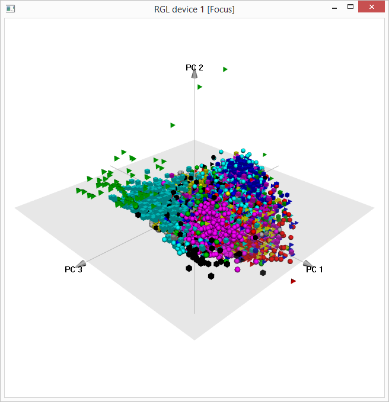

*****

```{r}
time.1 <- Sys.time()
format(time.1, "%Y-%m-%d-%H%M%S")
```

## Load TRAINING feature.matrix file

```{r}
format(Sys.time(), "%Y-%m-%d-%H%M%S")
load("plankton-train-wndchrm-features.Rdata", verbose=TRUE)
format(Sys.time(), "%Y-%m-%d-%H%M%S")
```

feature.matrix is a matrix of doubles for storage efficiency -- much better than a data.frame.

```{r}
class(feature.matrix)
typeof(feature.matrix)
```

## SVD analysis

```{r}
format(Sys.time(), "%Y-%m-%d-%H%M%S")
scaledTrain <- scale(feature.matrix[, -1])  # exclude class variable in first column
format(Sys.time(), "%Y-%m-%d-%H%M%S")
dim(scaledTrain)

format(Sys.time(), "%Y-%m-%d-%H%M%S")
svdTrain <- svd(scaledTrain)
format(Sys.time(), "%Y-%m-%d-%H%M%S")
```

Let's inspect sizes of the three [SVD](http://en.wikipedia.org/wiki/Singular_value_decomposition) components, u, d, and v.

(u and v are unitary rotation matrices and d is the diagonal of a scaling matrix.)

Note:  Original matrix can be constructed from SVD decomposition:

svdTrain$u %*% diag(svdTrain$d) %*% t(svdTrain$v) 

```{r}
dim(svdTrain$u)
length(svdTrain$d)
dim(svdTrain$v)
```

## Principal Component Analysis

Let's compute PCs separately with *prcomp* -- but PCA and SVD results are related.

```{r}
format(Sys.time(), "%Y-%m-%d-%H%M%S")
pcaTrain <- prcomp(scaledTrain)   # If not already scaled, use scale.=TRUE
format(Sys.time(), "%Y-%m-%d-%H%M%S")
```

```{r}
save(scaledTrain, svdTrain, pcaTrain, file="plankton-train-wndchrm-svd-pca.Rdata")
```

## First 75 Features

Let's look at first 75 features associated with largest 75 eigenvalues ...

```{r}
Neigen <- 75
```

```{r, fig.width=7, fig.height=7}
plot(svdTrain$d[1:Neigen]^2 / sum(svdTrain$d^2),pch=19,
     main=paste("Features associated with first", Neigen, "eigenvalues"),
     xlab="Eigenvalue rank",
     ylab="Fraction of variance explained by feature")
grid()
mtext(paste0(nrow(scaledTrain), " rows, ", ncol(scaledTrain), " variables"))

plot(cumsum(svdTrain$d[1:Neigen]^2 / sum(svdTrain$d^2)),pch=19,
     main=paste("First", Neigen, "eigenvalues"),
     xlab="Eigenvalue rank",
     ylab="Cumulative fraction of variance explained")
grid()
```

The plot above shows that first 75 features explain about 65% of the variance.

Features associated with the first Neigen eigenvalues explain large share of variance.

```{r, fig.width=7, fig.height=7}
boxplot(svdTrain$v[,1:Neigen],
        xlab="Eigenvalue rank",
        main="Boxplots of right singular vector weights")
mtext(paste("First", Neigen, "right singular vectors"))
```

## Patterns of variance in the rows

```{r, fig.width=7, fig.height=7}
par(mfrow=c(2,2))
smoothScatter(svdTrain$v[,1], main="Right singular vector v1")
smoothScatter(svdTrain$v[,2], main="Right singular vector v2")
smoothScatter(svdTrain$v[,3], main="Right singular vector v3")

par(mfrow=c(2,2))
smoothScatter(svdTrain$v[,1], svdTrain$v[,2])
smoothScatter(svdTrain$v[,1], svdTrain$v[,3])
smoothScatter(svdTrain$v[,2], svdTrain$v[,3])
```

## PCA and SVD

Show PCA results are the same as right singular vectors when SVD is done with scaled data.

```{r, fig.width=7, fig.height=7}
par(mfrow=c(2,2))
smoothScatter(pcaTrain$rotation[,1], pcaTrain$rotation[,2])
smoothScatter(pcaTrain$rotation[,1], pcaTrain$rotation[,3])
smoothScatter(pcaTrain$rotation[,2], pcaTrain$rotation[,3])  
```

## 3D interactive view of first three principal components 

The first column of feature.matrix gives the index of the 121 plankton classes in the training data.  This column is converted to a factor for displaying the plankton in different colors -- but with so many classes, they don't all have unique colors.

```{r}
library(rgl)
library(pca3d)
pca3d(pcaTrain, group=as.factor(feature.matrix[,1]))
```

There's a fairly long delay (a minute or two) before the interactive display appears.  

Shown below are three snapshots from interactive views of the first three principal components:




*****

```{r}
time.2 <- Sys.time()
cat(sprintf("%.1f", as.numeric(difftime(time.2, time.1, units="secs"))), " secs\n")
```

*****

*efg* @EarlGlynn

`r format(Sys.time(), "%Y-%m-%d  %H%M")`

